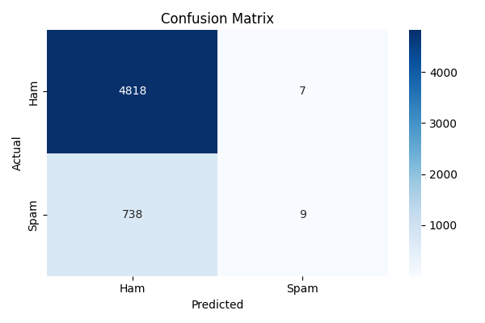

# 🚫📩 Spam Classifier with TensorFlow & Keras


<br><br>

## 🔍 Overview

This project is a **deep learning-based spam detection system** built with **TensorFlow and Keras**. It classifies SMS messages as either:

- ✅ **Ham** (Not Spam)  
- 🚨 **Spam**

You can **train**, **evaluate**, and **predict** from the command line using a friendly menu interface.

<br><br>

## 🧱 Project Structure
```bash
spam_classifier_project/
│
├── data/
│   └── processed/
│       └── spam_data_processed.csv       # 🧾 Preprocessed labeled dataset
│
├── outputs/
│   ├── models/
│   │   ├── spam_classifier.keras         # 🧠 Trained model file
│   │   └── tokenizer.pickle              # 🔠 Saved tokenizer
│   └── plots/
│       └── confusion_matrix.png          # 📉 Evaluation confusion matrix
│
├── src/
│   ├── train.py                          # 🏋️ Model training script
│   ├── evaluate.py                       # 📈 Evaluation script
│   ├── predict.py                        # 🔮 Predict message class (Spam or Ham)
│   └── model.py                          # 🏗️ Model architecture definition
│
├── main.py                               # 🧭 Main menu-based CLI entry point
├── requirements.txt                      # 📦 Project dependencies
└── README.md                             # 📘 Project documentation
```

<br><br>

## ⚙️ Setup Instructions

1. Clone or download the project.
   
   ```bash
   git clone https://github.com/yourusername/spam_classifier_project.git
   cd spam_classifier_project
   ```

3. 🧪 Create and activate virtual environment
   
   ```bash
   python -m venv venv
   # Windows
   venv\Scripts\activate
   # macOS/Linux
   source venv/bin/activate
   ```

3. 📦 Install dependencies

   ```bash
   pip install -r requirements.txt
   ```
<br><br>

## 🚀 How to Use

After setup, run the CLI tool:
```bash
python main.py
```

You'll see:

```mathematica
Select an option:
1. Train Model
2. Evaluate Model
3. Predict Message
Enter choice (1/2/3):
```
- **Train Model**: Trains and saves a model using the dataset

- **Evaluate Model**: Prints metrics & confusion matrix

- **Predict Message**: Input your own text to classify

<br><br>

## 📊 Dataset Format
The dataset is a CSV file with the following format:
| Label | Text                                                   |
|-------|--------------------------------------------------------|
| 0     | Ok lar... Joking wif u oni...                          |
| 1     | WINNER!! Claim your free prize now by texting 87121!   |

- **label**: 0 = Ham, 1 = Spam
- **text**: Message content

ℹ️ Make sure labels are numeric (0 and 1) and not 'ham', 'spam'.

<br><br>

## 🧠 Model Architecture
```text
Input Layer (100,)
↓
Dense(16, activation='relu')
↓
Dense(8, activation='relu')
↓
Dense(1, activation='sigmoid') → output: probability of spam
```
- Optimizer: **Adam**

- Loss: **Binary Crossentropy**

- Metric: **Accuracy**

- EarlyStopping: Patience of 3 (monitoring validation loss)

<br><br>

## 📈 Evaluation Output

When evaluating the model, you'll get:

- Classification report (precision, recall, f1-score)

- 📊 Confusion matrix heatmap

<p align="center">  </p>

<br><br>

## 💬 Example Prediction

```bash
Enter a message to classify (Spam or Ham): 
> Congratulations! You've won a free ticket!
Prediction: SPAM 🚨 (confidence: 0.94)
```

<br><br>

## 🛠️ Built With

- [Python 3.11](https://www.python.org)
- [TensorFlow](https://www.tensorflow.org/)
- [Keras](https://keras.io/)
- [Scikit-learn](https://scikit-learn.org/)
- [Matplotlib](https://matplotlib.org/)
- [Seaborn](https://seaborn.pydata.org/)
  
<br><br>

## 🧑‍💻 Contributing

Contributions are welcome!
To contribute:

1. Fork the repository

2. Create a new branch (`git checkout -b feature/feature-name`)

3. Commit your changes (`git commit -m 'Add some feature'`)

4. Push to the branch (`git push origin feature/feature-name`)

5. Open a Pull Request

<br><br>

## 📜 License

This project is licensed under the MIT License.


